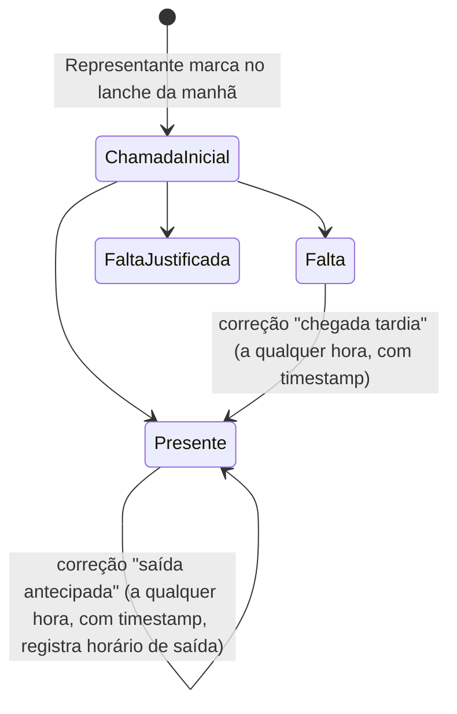

# Sistema de Chamada Digital para Representantes de Turma (CRT) - Especificação de Implementação para Claude Code

## 1. Visão Geral e Objetivo do Projeto

### 1.1 O que estamos construindo

Um sistema web (React Native + NativeWind, rodando como webapp/PWA acessível pelo celular) que digitaliza o processo de chamada escolar, hoje feito em papel por Representantes de Turma (CRT - Conselho de Representantes de Turmas).

A escola possui **9 turmas**. Cada turma tem **dois alunos designados como representantes** (atuando em regime de redundância mútua — qualquer um dos dois pode fazer a chamada, editar ou corrigir em qualquer dia, sem hierarquia fixa nem divisão de responsabilidade), responsáveis por, diariamente, marcar a presença de todos os colegas da turma. Hoje isso é feito numa ata física em papel, buscada na coordenação, onde o representante anota `F` para falta e deixa em branco para presença. O papel está degradado, o processo é lento, e não há como buscar dados, gerar relatórios ou fazer análises históricas.

### 1.2 O problema principal que estamos resolvendo

- Atas físicas se degradam fisicamente com o tempo e uso diário.
- Não há como pesquisar, filtrar ou analisar dados de frequência retroativamente.
- O processo é manual, sujeito a erro humano e inconsistência (representante às vezes não faz a chamada).
- Os professores, separadamente, também precisam lançar frequência no sistema estadual **SIEPE**, e hoje fazem isso sem nenhum apoio de dados consolidados.

### 1.3 Escopo do produto (visão de longo prazo, para contexto do Claude Code)

Duas ideias foram discutidas para resolver esse problema. **Apenas a primeira será implementada nesta fase.** A segunda é descrita neste documento apenas para dar contexto arquitetural de longo prazo — **não deve ser implementada agora**.

- **Ideia A (a ser implementada agora): App do Representante.** Representante de cada turma faz a chamada digital pelo celular, os dados vão para um banco de dados relacional, e a coordenação/professores podem consultar.
- **Ideia B (futuro, não implementar agora): Chamada via RFID.** Cada aluno teria um crachá com chip RFID (leitura via módulo RC522 + microcontrolador ESP32 por sala), tocando um leitor ao entrar na escola/sala, gerando presença automática, com notificação em tempo real por e-mail para os pais. No futuro, os dados da Ideia A (representante) e da Ideia B (RFID) devem poder ser cruzados/validados entre si: se o representante marcar falta mas o RFID registrar presença (ou vice-versa), o sistema deve sinalizar uma divergência para revisão da coordenação — isso serve tanto para pegar erro humano do representante quanto fraude de cartão emprestado entre alunos. **Esse cruzamento é um objetivo de arquitetura de longuíssimo prazo e não deve influenciar decisões de implementação da v1.**

### 1.4 Priorização confirmada pelo usuário

O núcleo real do projeto é o representante. O painel do professor é uma funcionalidade bônus/opcional ("é pra quem quiser"), não o motivo do projeto existir. Portanto:

- **Fase 1 (implementar agora):** cadastro/login de representantes, fluxo completo de chamada, calendário/histórico, correções pontuais (chegada tardia/saída antecipada), e uma página primitiva de coordenação só para cadastro inicial de turmas/alunos.
- **Fase 2 (não implementar agora, documentado para continuidade):** painel do professor (relatório do dia, marcação de lançamento no SIEPE, alertas opt-in por e-mail), papel completo de coordenação/gestão (análise de aluno/turma), e a Ideia B (RFID).

---

## 2. Stack Tecnológica e Arquitetura

### 2.1 Frontend

- **React Native + Tailwind CSS**, via **NativeWind** (Tailwind puro não funciona em React Native sem essa camada de tradução — confirmar se o projeto usa Expo + NativeWind, que é o caminho mais rápido de desenvolver/testar via QR code).
- **Vite** como bundler/dev server.

### 2.2 Backend

- **Node.js** como runtime da API.
- **Banco de dados: PostgreSQL via Supabase.**
  - Motivo da escolha: o domínio é fundamentalmente relacional (turma → aluno → representante → chamada → presença), o que se modela mal em NoSQL (Firestore, usado em projetos anteriores do usuário, foi descartado — ver seção 3).
  - Supabase resolve, com plano gratuito: (a) concorrência de escrita (até 18 representantes — 2 por turma, ver seção 3.9 — podendo fazer chamada quase simultaneamente de manhã, cenário que travava SQLite puro), (b) relatórios SQL nativos (frequência, percentual de falta etc.), (c) auth pronta, reutilizável para o login dos representantes.
- **ORM: Prisma.** Schema único, legível, fácil de ajustar (alinhado ao valor do usuário por "ajustes fáceis de fazer"), com SQL cru disponível quando necessário via Prisma.
- **Alternativa registrada mas não escolhida:** Turso (SQLite distribuído) — mantém a familiaridade do usuário com SQLite e resolve concorrência, mas perde robustez de relatórios SQL completos e auth pronta. Não seguir por esse caminho a menos que instruído.

### 2.3 Arquitetura de pastas esperada

Baseada em projeto anterior do usuário (mesma convenção deve ser reaproveitada):

```
src/
  components/
  context/
  hooks/
  pages/
  routes/
  services/      <- client do Supabase/Prisma entra aqui (antes era client do Firestore)
  utils/
  App.jsx
  index.css
  main.jsx
.env
.gitignore
package.json
postcss.config.js
tailwind.config.js
vite.config.js
prisma/
  schema.prisma
  migrations/
```

**Arquivos específicos do Firebase (`firebase.json`, `.firebaserc`, `firestore.rules`, `firestore.indexes`) NÃO existem neste projeto** — são substituídos pelos equivalentes do Prisma/Supabase (pasta `prisma/`).

A pasta `services/` deve manter o mesmo papel que tinha no projeto anterior (camada de acesso a dados), só trocando a implementação interna.

### 2.4 Padrões de projeto relevantes

- **RBAC (Role-Based Access Control):** após login, o sistema identifica o `cargo` do usuário (aluno/representante ou professor) e renderiza automaticamente só as telas/permissões daquele papel. Não deve existir seleção manual de "modo" pelo usuário.
- **Local-first / autosave otimista:** toda marcação de presença durante a chamada é gravada de forma incremental e imediata (não existe um "salvar tudo no final"). Ver detalhamento na seção 4.
- **Soft state / deactivate-not-delete para representantes:** troca de representante de turma não deve apagar o registro antigo, e sim desativá-lo e ativar o novo, preservando histórico e integridade referencial.

---

## 3. Histórico de Alterações e Decisões de Design (A Memória do Chat)

Esta seção documenta a evolução do raciocínio ao longo da conversa — o "porquê" por trás de cada decisão, para que o Claude Code não reverta acidentalmente uma escolha já descartada.

### 3.1 Banco de dados: Firebase/Firestore → Postgres/Supabase

- **Antes:** usuário usava Firebase/Firestore em projetos anteriores. Funciona bem no plano grátis para projetos pequenos.
- **Por que foi descartado:** para ~300+ alunos, 9 turmas, chamadas diárias simultâneas e necessidade de relatórios (frequência, histórico, percentuais), Firestore é NoSQL e o domínio é essencialmente relacional — modelar isso em Firestore geraria duplicação de dados e dificuldade real para fazer queries agregadas.
- **Também descartado:** SQLite puro — insuficiente para múltiplas escritas concorrentes (vários representantes fazendo chamada ao mesmo tempo pela manhã).
- **Depois:** PostgreSQL via Supabase + Prisma. Decisão fechada.

### 3.2 Escopo de papéis: 4 papéis → 2 papéis na v1

- **Antes:** ideia inicial incluía 4 papéis no cadastro — aluno (representante), professor, coordenação, gestão — com coordenação/gestão tendo permissões extras (cadastrar turma, ver análise de aluno/turma).
- **Depois:** para não sobrecarregar a v1, coordenação e gestão como *papéis completos* foram adiados. Fica só aluno (representante) e professor no sistema de cadastro/login real. Coordenação recebe, por enquanto, apenas uma **página primitiva separada**, fora do sistema de papéis, só para bootstrap de dados (ver seção 3.5).

### 3.3 Granularidade da chamada: por aula → por dia

- **Pergunta levantada:** o status de presença deveria ser um valor por (aluno, dia) ou um valor por (aluno, dia, aula/período)?
- **Motivo da pergunta:** afeta diretamente o desenho da tabela de presença — uma linha por dia é muito mais simples; uma linha por período exigiria conhecer a grade horária de cada turma para saber "qual é a aula agora".
- **Decisão final do usuário (explícita):** **por dia.** Justificativa do próprio usuário: o aluno não pode ficar abrindo o celular toda hora durante a aula, e o SIEPE opera em nível de dia. **Isso é definitivo — não implementar granularidade por período.**

### 3.4 O problema do "snapshot único" → status vivo com correções

- **Problema identificado pelo usuário (chamado de "a bomba"):** se a chamada é feita uma vez só de manhã (no intervalo do lanche), o que acontece com: (a) alunos que ainda não chegaram nas primeiras aulas antes da chamada acontecer; (b) alunos que chegam atrasados depois da chamada já feita; (c) alunos que saem mais cedo depois de já terem sido marcados como presentes?
- **Solução (a):** não é um problema real — o professor das primeiras aulas simplesmente faz o SIEPE manualmente como sempre fez, sem o apoio do relatório do app. O relatório é auxiliar, nunca obrigatório/bloqueante.
- **Solução (b) e (c):** o modelo de dados não deve tratar a chamada como uma "foto tirada uma vez", e sim como um **estado vivo, atualizável ao longo do dia**. Introduzir um tipo de ação distinto de "fazer a chamada": **"correção pontual"** (chegada tardia / saída antecipada), disponível ao representante a qualquer hora do dia, que atualiza o status do aluno E grava um registro de auditoria com timestamp (ex.: "chegou às 9h40").
- **Reconciliação com a trava de 20 minutos (ver 3.6):** a trava de 20 min se aplica apenas à sessão de finalização da chamada inicial (proteção contra edição acidental/idle). As correções pontuais são uma ação diferente, sempre disponíveis, e não são afetadas por essa trava.

### 3.5 Apagar histórico após virar bolinha no calendário → NÃO apagar (contradição resolvida)

- **Pedido original do usuário:** depois que a chamada de um dia vira uma bolinha colorida no calendário (visualização resumida), os dados detalhados daquele dia poderiam ser apagados, para "economizar processamento e dados inúteis".
- **Contradição identificada:** o usuário também pediu que a coordenação pudesse puxar a chamada detalhada de um dia passado depois. As duas coisas são incompatíveis se os dados forem de fato apagados — não há como reconstruir dado deletado.
- **Resolução:** **não apagar nada.** Cálculo de volume: 9 turmas × ~35 alunos × ~200 dias letivos/ano ≈ 63.000 linhas/ano — irrisório para Postgres, não representa problema de performance algum. **O calendário com bolinhas é apenas uma view/consulta agregada em cima dos dados completos, que permanecem intactos indefinidamente.** Claude Code não deve implementar nenhuma rotina de exclusão automática de registros de presença.

### 3.6 Janela de 20 minutos pós-finalização

- **Regra confirmada:** ao finalizar a chamada, o representante tem 20 minutos para ainda editar/corrigir (mudança de emergência). Depois desse período, a sessão de chamada daquele dia trava e não pode mais ser editada por essa via.
- **Importante:** essa trava NÃO impede as correções pontuais (chegada tardia/saída antecipada) descritas na seção 3.4, que continuam disponíveis a qualquer hora do dia como uma ação separada, não como reabertura da sessão original.

### 3.7 Fast-inject-file: de "carga contínua com diff" → "carga única + manutenção manual"

- **Mal-entendido inicial:** Claude interpretou que a coordenação poderia reimportar o arquivo Excel ao longo do ano para refletir mudanças (aluno que saiu/entrou), o que exigiria lógica de comparação (diff) entre a lista antiga e a nova.
- **Correção do usuário:** o import do arquivo Excel roda **uma única vez**, no início (carga inicial de todas as turmas e alunos). Qualquer alteração depois disso (aluno que saiu da turma/escola, aluno novo) é feita **manualmente**, pela própria interface da coordenação, entrando na turma específica e editando individualmente (adicionar/remover aluno).
- **Impacto na implementação:** **não construir nenhuma lógica de diff/reconciliação de reimport.** O fast-inject-file é uma ferramenta de bootstrap único. A manutenção contínua é um CRUD simples de alunos por turma.

### 3.8 Formato real do arquivo de importação (validado com arquivo real)

O usuário enviou um arquivo real (`ENTURMAÇÃO_-_1_anos.xlsx`), inspecionado e confirmado como o padrão universal que a gestão sempre vai fornecer. Estrutura observada:

- O arquivo Excel contém **uma aba (sheet) por turma**. No exemplo, as abas se chamavam `1A`, `1B`, `1C`.
- **O nome da aba já identifica a turma** — não é necessário (nem deve ser feito) adivinhar a turma a partir do conteúdo da planilha.
- Dentro de cada aba: título da turma por volta da linha 3 (ex.: "1º ANO A"), cabeçalho com as colunas `MATRICULA` e `NOME` por volta da linha 4, dados começando por volta da linha 6.
- **Coluna A = matrícula** (numérica). **Coluna B (mesclada com C e D) = nome completo do aluno** (mesclagem existe só porque nomes são longos, o valor real está sempre na primeira célula da mesclagem).
- **O número de linhas de dados varia por turma** (no exemplo: 35, 43 e 44 alunos respectivamente) — o parser deve ler até encontrar uma linha vazia, nunca assumir uma quantidade fixa de linhas.

### 3.9 Um representante por turma → dois representantes por turma (redundância mútua)

- **Correção tardia do usuário:** depois de todo o resto do sistema já estar desenhado, o usuário informou que, na realidade, **cada turma tem dois representantes**, não um só. Essa informação não estava presente em nenhuma decisão anterior deste documento.
- **Como os dois convivem (confirmado explicitamente pelo usuário):** modelo **livre/redundante** — qualquer um dos dois pode fazer a chamada, finalizar, ou aplicar uma correção pontual, em qualquer dia, sem hierarquia de titular/backup e sem divisão fixa da turma entre eles. Não há turno, não há "vez de cada um".
- **Efeito colateral positivo — resolve um caso de borda que estava em aberto:** a seção 6.1 desta especificação (versão anterior) tinha o item "representante falta ou esquece de fazer a chamada" marcado como **não resolvido**, cogitando um "vice-representante" hipotético como possível solução. A existência de dois representantes reais resolve isso nativamente — se um faltar ou esquecer, o outro pode agir. Esse item do checklist de casos de borda foi atualizado para refletir a resolução (ver seção 6.1 revisada).
- **Impacto arquitetural identificado:** como agora existem duas pessoas fisicamente diferentes que podem tocar o mesmo registro de chamada, passa a ser necessário **registrar autoria** — qual dos dois representantes fez cada ação (a chamada inicial, cada correção pontual, cada atualização de status) — algo que não era necessário rastrear quando só existia um representante por turma. Isso NÃO exige nenhuma mudança na granularidade da chamada (continua uma linha por aluno por dia, ver 3.3) nem na trava de 20 minutos (ver 3.6, que continua valendo sobre o registro de `Chamada` como um todo, não por pessoa) — é apenas a adição de campos de autoria (`representanteId`) nos registros já existentes. Ver schema atualizado na seção 7.1.
- **Modelo de dados:** o `Representante.turmaId` **nunca teve** uma constraint de unicidade neste schema (ver 7.1) — ou seja, a estrutura já suportava múltiplos representantes ativos por turma sem precisar de nenhuma alteração estrutural nessa parte. A mudança real está só na adição dos campos de autoria mencionados acima.
- **Cadastro:** cada turma passa a precisar de **dois códigos de matrícula válidos** (um por representante) gerados pelo programa externo, em vez de um único código por turma. Não há mudança de arquitetura no fluxo de cadastro em si (seção 4.1) — o mecanismo de whitelist por código já funciona por pessoa, não por turma.

---

## 4. Fluxos de Dados e Lógica de Negócio Detalhada

### 4.1 Cadastro (Registration)

**Campos comuns a todo cadastro:**
- Login (baseado em código de matrícula, gerado por um programa/processo separado — funciona como whitelist/convite: só quem possui um código válido pode se cadastrar).
- Senha (definida pelo próprio usuário no momento do cadastro).
- Cargo: `aluno` (representante) ou `professor`. (Campos de `coordenação`/`gestão` NÃO devem existir no formulário de cadastro nesta fase.)

**Campos específicos por cargo:**

| Cargo | Campos adicionais |
|---|---|
| `aluno` (representante) | `turma` (selecionada de um dropdown vindo das 9 turmas já cadastradas no banco — **nunca texto livre**), `nome` |
| `professor` | acesso de leitura a todas as 9 turmas (não é um campo armazenado, é uma permissão), `nome`, "histórico" (ver seção 4.3 — na prática é o registro de marcação de lançamento no SIEPE por turma/dia) |

**Importante sobre escala:** o lado `aluno`/representante do sistema é usado por **apenas 18 pessoas** (dois por turma, 9 turmas — ver decisão 3.9), não pelo corpo discente inteiro (~300+ alunos). Isso deve orientar decisões de capacidade e simplicidade de interface — não é um sistema de massa, é um sistema para um grupo pequeno e fixo de usuários de confiança. Cada turma precisa de **dois códigos de matrícula válidos** gerados pelo programa externo (um por representante), não apenas um.

### 4.2 Pós-login: roteamento por papel (RBAC)

Ao logar, o sistema deve:
1. Consultar o cargo do usuário no banco.
2. Redirecionar automaticamente para o dashboard correspondente (`aluno`/representante → tela de chamada + calendário; `professor` → dashboard de turmas, quando essa fase for implementada).
3. Nunca exigir seleção manual de "que tipo de usuário eu sou" — isso já está determinado pelo cadastro.

**UX de login persistente:** para resolver o incômodo relatado de ter que digitar/lembrar login e senha com frequência, a sessão deve persistir no dispositivo (token salvo) após o primeiro login, evitando reautenticação repetida. QR code de login foi cogitado como possível melhoria futura, não é requisito da v1.

### 4.3 Fluxo do representante (aluno) — NÚCLEO DO SISTEMA

**Modelo de dois representantes por turma (ver decisão 3.9):** a chamada de uma turma em um dia é **um único registro compartilhado** (`Chamada`, único por `turmaId` + `data`) — não existe um registro por representante. Isso significa que qualquer um dos dois representantes daquela turma que abrir o app vê exatamente o mesmo estado (inclusive um estado "parcial" iniciado pelo colega) e pode continuar de onde o outro parou. É o mesmo mecanismo já usado para retomar uma chamada interrompida por queda de internet (seção 4.3.2) — agora ele também serve para "o colega começou, eu termino".

#### 4.3.1 Tela inicial
Duas ações principais disponíveis:
- Fazer nova chamada (do dia atual).
- Ver histórico (calendário).

#### 4.3.2 Fazer chamada
- Lista de alunos da turma do representante (nomes exibidos na interface; internamente o backend pode/deve usar identificadores internos numéricos para os alunos, por eficiência — a tradução nome↔id é responsabilidade do backend/frontend, nunca exposta como lógica de negócio ao usuário).
- Para cada aluno, o representante marca um de três status: **Presente (P)**, **Falta (F)**, **Falta Justificada (FJ)**.
- **Gravação incremental (padrão local-first/autosave):** cada marcação individual deve ser persistida imediatamente no backend assim que feita — não esperar um "enviar tudo" no final da lista inteira. Isso protege contra perda de conexão no meio da chamada.
- Se a internet cair ou o processo for interrompido no meio, ao reabrir o app (pelo mesmo representante ou pelo colega) a chamada deve continuar exatamente de onde parou, com as marcações já feitas preservadas.
- Cada marcação individual deve gravar **qual dos dois representantes** a fez (campo `ultimaAtualizacaoPorRepresentanteId` em `Presenca`, ver seção 7.1) — não para restringir edição, apenas para auditoria/transparência.

#### 4.3.3 Finalizar chamada e janela de correção
- Ao marcar todos os alunos, **qualquer um dos dois representantes** pode "finalizar" a chamada — não precisa ser o mesmo que iniciou.
- A trava de 20 minutos é sobre o registro `Chamada` como um todo, não por pessoa: durante os **20 minutos seguintes à finalização**, **qualquer um dos dois** ainda pode editar livremente (mudança de emergência).
- Após 20 minutos, essa sessão de chamada trava para os dois — não pode mais ser reaberta/editada por esse fluxo, independentemente de quem tentar.
- Registrar quem finalizou (campo `finalizadaPorRepresentanteId` em `Chamada`, ver seção 7.1), por auditoria.

#### 4.3.4 Correções pontuais (chegada tardia / saída antecipada)
- Ação **separada** da chamada original, disponível **a qualquer hora do dia**, independente da trava de 20 minutos, e disponível para **qualquer um dos dois representantes** da turma, independente de quem fez a chamada original.
- Dois tipos: "chegada tardia" (aplicável a um aluno atualmente marcado como Falta, atualiza para Presente) e "saída antecipada" (aplicável a um aluno atualmente marcado como Presente, registra a saída).
- Toda correção deve gravar um registro de auditoria com **timestamp** e **autoria** (`representanteId`, campo obrigatório em `CorrecaoPontual`, ver seção 7.1) — para que qualquer consulta posterior ao dado saiba não só o status final, mas o histórico de mudanças daquele aluno naquele dia e quem fez cada uma.

#### 4.3.5 Calendário / histórico
- Visualização em formato de calendário mensal.
- Cada dia recebe uma cor conforme o estado da chamada daquele dia:
  - **Verde:** chamada feita/completa.
  - **Vermelho:** chamada não feita.
  - **Laranja:** chamada parcial/incompleta (foi iniciada mas não finalizada — por exemplo, interrompida por queda de conexão).
- **Este calendário é uma view agregada sobre os dados completos de presença — os dados detalhados de cada dia NUNCA devem ser apagados após o cálculo da bolinha.** Ver seção 3.5 para a justificativa completa desta decisão.
- A coordenação deve poder, futuramente, puxar a chamada detalhada de qualquer dia passado de qualquer turma — isso só é possível porque os dados brutos são preservados indefinidamente.

### 4.4 Fluxo do professor (Fase 2 — não implementar agora, documentado para continuidade)

- Dashboard listando as 9 turmas, com busca/filtro.
- Dentro de uma turma: "relatório do dia", mostrando **apenas quem faltou ou tem falta justificada** (não lista todo mundo — inverte a lógica para mostrar só a exceção, já que faltas costumam ser a minoria). O objetivo é agilizar o lançamento manual do professor no SIEPE.
- O relatório deve ser tratado como um dado "vivo": a interface precisa mostrar claramente a hora da última atualização, e ter um estado explícito de "chamada de hoje ainda não foi feita" — para nunca confundir o professor com dado desatualizado de um dia anterior.
- Professor pode marcar, por turma e por dia, um flag simples "já lancei essa turma no SIEPE" (booleano + timestamp). Esse flag constitui o "histórico" do professor mencionado no cadastro.
- **Alertas opt-in por e-mail:** professor pode ativar, no perfil, o recebimento de um alerta automático (via job agendado, ex.: rodando às 17h) caso a chamada de uma turma vinculada a ele não tenha sido feita naquele dia. Canal: e-mail (mais simples e barato que SMS/WhatsApp, que cobram por mensagem via API).

### 4.5 Página primitiva de coordenação (implementar agora, mas como ferramenta utilitária isolada)

**Não faz parte do sistema de papéis/RBAC.** É uma tela separada, protegida por um mecanismo de acesso mais simples (ex.: senha única compartilhada com quem administra), já que é usada por apenas 2-3 pessoas de confiança, poucas vezes ao ano.

Funcionalidades:
- Cadastro de turma.
- Import inicial de alunos via fast-inject-file (ver seção 4.6) — **executado uma única vez**, no bootstrap do sistema.
- CRUD manual de alunos por turma (adicionar aluno, remover aluno, editar dados) — este é o mecanismo usado para **toda** manutenção contínua ao longo do ano letivo (aluno que sai, aluno novo que entra). Não deve existir nenhum fluxo de reimport de arquivo para isso.

### 4.6 Fast-inject-file (import de Excel) — especificação detalhada

**Formato de entrada esperado** (validado com arquivo real, ver seção 3.8):
- Um único arquivo `.xlsx`.
- Uma aba por turma; o **nome da aba identifica a turma** (ex.: "1A" → mapear para "1º Ano A", esse mapeamento pode ser confirmado uma vez pela coordenação).
- Dentro de cada aba: procurar a linha de cabeçalho contendo `MATRICULA` e `NOME` (aproximadamente linha 4 no formato observado, mas o parser deve localizar dinamicamente, não assumir posição fixa).
- A partir da linha seguinte ao cabeçalho, ler cada linha: coluna A = matrícula (numérico), coluna B = nome completo (considerar que B:D podem estar mescladas — ler sempre o valor da primeira célula da mesclagem).
- Parar a leitura ao encontrar a primeira linha completamente vazia daquela aba.

**Fluxo de import:**
1. Coordenação faz upload de um único arquivo contendo todas as turmas.
2. Sistema itera todas as abas do arquivo.
3. Para cada aba, localiza cabeçalho, lê linhas até encontrar vazio, monta lista de (matrícula, nome) daquela turma.
4. **Pré-visualização obrigatória antes de gravar:** mostrar para a coordenação, por turma, quantos alunos foram encontrados e uma amostra dos dados lidos (ex.: "1A: 35 alunos encontrados"), permitindo correção manual antes da gravação definitiva.
5. Só após confirmação explícita da coordenação, os dados são persistidos no banco.

**Restrição confirmada:** este fluxo roda **apenas uma vez** por instalação do sistema (carga inicial). Não implementar lógica de reimport, diff ou sincronização — mudanças pós-carga inicial são sempre manuais via CRUD (seção 4.5).

---

## 5. Roteiro Passo a Passo de Implementação (Instruções para o Claude Code)

> Este roteiro cobre exclusivamente a **Fase 1** (representante + página primitiva de coordenação). Não implementar itens da Fase 2 (professor, SIEPE, alertas, RFID) a menos que explicitamente instruído em uma sessão futura.

**Passo 1 — Setup do projeto**
- Inicializar projeto com Vite + React Native (ou Expo, confirmar com o usuário se ainda não estiver claro) + NativeWind configurado corretamente (verificar `tailwind.config.js` e `postcss.config.js`).
- Estruturar as pastas conforme seção 2.3.

**Passo 2 — Banco de dados**
- Criar projeto no Supabase.
- Instalar e configurar Prisma, apontando para o Postgres do Supabase.
- Modelar o schema Prisma cobrindo, no mínimo: `Turma`, `Aluno`, `Representante` (com suporte a histórico/troca via ativo/inativo, não deleção; **até 2 ativos por turma simultaneamente**, ver seção 3.9), `Usuario` (login/senha/cargo), `Chamada` (uma por turma/dia, com campo de autoria de quem finalizou), `Presenca` (uma por aluno por chamada, status P/F/FJ, com campo de autoria da última atualização), `CorrecaoPontual` (log de correções com timestamp, autoria obrigatória, tipo chegada_tardia/saida_antecipada, vinculada a uma `Presenca`).
- Rodar a primeira migration.

**Passo 3 — Autenticação**
- Implementar cadastro (matrícula como código de convite/validação + senha definida pelo usuário + seleção de cargo aluno/professor).
- Implementar login com sessão persistente no dispositivo.
- Implementar middleware/guard de RBAC que redireciona pós-login conforme o cargo.

**Passo 4 — Página primitiva de coordenação**
- Implementar autenticação simples (senha única) separada do sistema de cadastro de usuários.
- Implementar tela de cadastro de turma.
- Implementar o fast-inject-file: upload de `.xlsx`, parser conforme seção 4.6, tela de pré-visualização, confirmação, gravação.
- Implementar CRUD manual de alunos por turma.

**Passo 5 — Fluxo do representante: chamada**
- Tela de listagem de alunos da turma do representante logado (lembrar: a turma tem 2 representantes ativos, ambos veem e podem editar o mesmo registro de `Chamada` do dia — não filtrar por "dono" da chamada).
- Interação de marcação de status (P/F/FJ) por aluno, com gravação incremental imediata a cada marcação (endpoint de "upsert" de presença por aluno, chamado a cada toque, não em lote), gravando `ultimaAtualizacaoPorRepresentanteId` a cada toque.
- Botão de finalizar chamada, disponível a qualquer um dos dois representantes, iniciando a janela de 20 minutos de edição livre (implementar via timestamp de finalização + checagem de janela no backend, não confiar em timer só no frontend), gravando `finalizadaPorRepresentanteId`.

**Passo 6 — Correções pontuais**
- Interface para **qualquer um dos dois representantes** da turma acessar, a qualquer momento do dia, uma lista de alunos da chamada do dia e aplicar "chegada tardia" ou "saída antecipada", atualizando o status e criando um registro em `CorrecaoPontual` com timestamp e `representanteId` obrigatório.
- Esta ação deve ser possível independentemente de já terem se passado os 20 minutos da janela de finalização (é um caminho de código separado do Passo 5), e independente de qual dos dois representantes finalizou a chamada originalmente.

**Passo 7 — Calendário/histórico**
- Endpoint que agrega, por dia, o status geral da chamada da turma do representante logado (completa/não feita/parcial) para popular o calendário.
- Tela de calendário com as cores conforme seção 4.3.5.
- Garantir que nenhuma rotina de limpeza/exclusão de dados de presença seja implementada — os dados de `Presenca` e `CorrecaoPontual` são permanentes.

**Passo 8 — Revisão de ponta a ponta**
- Testar o ciclo completo: cadastro do representante → login → chamada → finalização → correção pontual → visualização no calendário → simulação de coordenação puxando dados de um dia específico via query direta (mesmo sem UI de coordenação avançada, validar que o dado está lá e é consultável).

---

## 6. Casos de Borda, Restrições e Tratamento de Erros

### 6.1 Casos de borda discutidos

- **Representante falta ou esquece de fazer a chamada em um dia: RESOLVIDO por design (ver decisão 3.9).** Cada turma tem dois representantes ativos, em regime de redundância mútua e sem hierarquia — se um faltar ou esquecer, o outro pode fazer a chamada, finalizar, ou aplicar correções normalmente. Não é necessário nenhum mecanismo de emergência adicional (nem vice-representante, nem permissão especial de coordenação) para cobrir este caso.
- **Os dois representantes de uma turma mexem na chamada do mesmo dia (concorrência entre os dois):** não é tratado como conflito. Como `Chamada` é um registro único por `turmaId` + `data` (não por representante), os dois simplesmente editam o mesmo documento — a última escrita em cada campo prevalece (last-write-wins), consistente com o padrão de autosave incremental já adotado (seção 4.3.2). Cada marcação/correção registra qual representante a fez (ver 3.9 e 7.1), então mesmo sem bloqueio de concorrência, sempre é possível auditar depois quem fez o quê. Não implementar lock pessimista nem UI de "fulano está editando agora" na v1 — não foi solicitado e adicionaria complexidade desnecessária para um cenário de baixa frequência (dois representantes da mesma turma raramente estarão no app no mesmíssimo segundo).
- **Conexão cai no meio da chamada:** deve resultar em estado "parcial" (bolinha laranja), com a chamada retomável do ponto exato em que parou, graças à gravação incremental (seção 4.3.2).
- **Aluno chega atrasado depois da chamada finalizada:** tratado via correção pontual (seção 4.3.4), não como reabertura da chamada original.
- **Aluno sai mais cedo depois de já estar marcado como presente:** mesmo mecanismo de correção pontual.
- **Import de Excel com linhas vazias no meio da planilha (não só no final):** o parser deve ser robusto o suficiente para não quebrar — mas o critério de parada é a primeira linha vazia encontrada (conforme observado no arquivo real, não havia esse caso, mas vale validação defensiva).
- **Quantidade de linhas diferente por turma no arquivo Excel:** confirmado que isso é normal (35, 43, 44 no exemplo real) — nunca assumir contagem fixa de alunos por aba.

### 6.2 Restrições técnicas

- **Escala:** o sistema deve ser dimensionado para ~300+ alunos, 9 turmas, ~200 dias letivos/ano — um volume trivial para Postgres, não deve influenciar decisões de exclusão/agregação de dados por "economia de espaço" (ver seção 3.5 — essa preocupação foi explicitamente descartada como desnecessária).
- **Concorrência:** o sistema deve suportar múltiplos representantes (até 18 — 2 por turma, ver 3.9) fazendo chamada simultaneamente sem conflito de escrita — este foi justamente o motivo da migração de SQLite/Firestore para Postgres. Inclui o caso dos dois representantes da mesma turma editando a mesma `Chamada` ao mesmo tempo (resolvido via last-write-wins, ver 6.1).
- **Segurança do cadastro:** o código de matrícula usado no cadastro do representante deve funcionar como um mecanismo de whitelist — cadastro não deve ser aberto livremente sem esse código válido.
- **Privacidade (nota para fases futuras, não bloqueante agora):** caso a Ideia B (RFID, com fotos e dados de frequência de menores) seja implementada no futuro, será necessário desenhar controle de acesso e possivelmente consentimento dos responsáveis para uso de foto em crachá. Não é uma restrição da Fase 1, mas deve ser mantida em mente para não fechar portas arquiteturais.

---

## 7. Prompts, Snippets e Trechos de Código Consolidados

### 7.1 Schema Prisma proposto (ponto de partida — Claude Code deve refinar conforme necessário)

```prisma
// prisma/schema.prisma
// NOTA: este é um esqueleto de partida derivado das decisões da conversa.
// Nomes de tabelas/campos em português para manter consistência com o domínio do projeto.

model Turma {
  id             String          @id @default(uuid())
  nome           String          // ex: "1º Ano A"
  codigoPlanilha String?         // ex: "1A", mapeamento com a aba do Excel de origem
  alunos         Aluno[]
  representantes Representante[]
  chamadas       Chamada[]
  criadoEm       DateTime        @default(now())
}

model Aluno {
  id        String   @id @default(uuid())
  matricula String   @unique
  nome      String
  turmaId   String
  turma     Turma    @relation(fields: [turmaId], references: [id])
  presencas Presenca[]
  criadoEm  DateTime @default(now())
}

model Usuario {
  id        String   @id @default(uuid())
  matricula String   @unique
  senhaHash String
  cargo     Cargo    // aluno | professor
  nome      String
  representante Representante?
  criadoEm  DateTime @default(now())
}

enum Cargo {
  aluno
  professor
}

model Representante {
  id        String   @id @default(uuid())
  usuarioId String   @unique
  usuario   Usuario  @relation(fields: [usuarioId], references: [id])
  turmaId   String
  turma     Turma    @relation(fields: [turmaId], references: [id])
  ativo     Boolean  @default(true) // sai do cargo = desativar este, não deletar
  inicioEm  DateTime @default(now())
  fimEm     DateTime?

  // Autoria (ver decisão 3.9 - cada turma tem 2 representantes ativos,
  // atuando com redundância mútua, então é preciso registrar quem fez o quê)
  chamadasFinalizadas  Chamada[]         // chamadas que este representante finalizou
  presencasAtualizadas Presenca[]        // presenças cuja última marcação foi deste representante
  correcoes            CorrecaoPontual[] // correções pontuais aplicadas por este representante

  // NOTA: turmaId NUNCA teve constraint de unicidade aqui — o schema já
  // suporta nativamente mais de um representante ativo por turma.
}

model Chamada {
  id           String    @id @default(uuid())
  turmaId      String
  turma        Turma     @relation(fields: [turmaId], references: [id])
  data         DateTime  @db.Date
  status       StatusChamada // completa | nao_feita | parcial
  finalizadaEm DateTime?     // usado para calcular a janela de 20 minutos (vale para os 2 representantes)

  finalizadaPorRepresentanteId String?
  finalizadaPorRepresentante   Representante? @relation(fields: [finalizadaPorRepresentanteId], references: [id])

  presencas    Presenca[]

  @@unique([turmaId, data])
}

enum StatusChamada {
  completa
  nao_feita
  parcial
}

model Presenca {
  id           String   @id @default(uuid())
  chamadaId    String
  chamada      Chamada  @relation(fields: [chamadaId], references: [id])
  alunoId      String
  aluno        Aluno    @relation(fields: [alunoId], references: [id])
  status       StatusPresenca // presente | falta | falta_justificada
  atualizadoEm DateTime @updatedAt

  ultimaAtualizacaoPorRepresentanteId String?
  ultimaAtualizacaoPorRepresentante   Representante? @relation(fields: [ultimaAtualizacaoPorRepresentanteId], references: [id])

  correcoes    CorrecaoPontual[]

  @@unique([chamadaId, alunoId])
}

enum StatusPresenca {
  presente
  falta
  falta_justificada
}

model CorrecaoPontual {
  id          String   @id @default(uuid())
  presencaId  String
  presenca    Presenca @relation(fields: [presencaId], references: [id])

  representanteId String        // obrigatório - sempre saber qual dos 2 representantes aplicou
  representante   Representante @relation(fields: [representanteId], references: [id])

  tipo        TipoCorrecao // chegada_tardia | saida_antecipada
  horario     DateTime @default(now())
  observacao  String?
}

enum TipoCorrecao {
  chegada_tardia
  saida_antecipada
}
```

### 7.2 Diagrama de estados da presença (mermaid, para referência do Claude Code)



### 7.3 Estrutura de leitura do fast-inject-file (pseudo-lógica de referência)

```
para cada aba do arquivo .xlsx:
    nome_turma = mapear(nome_da_aba)  # ex: "1A" -> "1º Ano A"
    linha_cabecalho = localizar_linha_contendo("MATRICULA", "NOME")
    linha_atual = linha_cabecalho + 1
    alunos_lidos = []

    enquanto linha_atual não estiver vazia:
        matricula = coluna_A[linha_atual]
        nome = coluna_B[linha_atual]  # considerar mesclagem B:D, valor sempre na primeira célula
        alunos_lidos.append({matricula, nome})
        linha_atual += 1

    exibir_pre_visualizacao(nome_turma, alunos_lidos)
    # só grava no banco após confirmação explícita da coordenação
```

### 7.4 Regras de negócio consolidadas (checklist rápido para validação de implementação)

- [ ] Granularidade de presença é sempre **por dia**, nunca por período/aula.
- [ ] Marcação de presença é **incremental/imediata**, nunca em lote no final.
- [ ] Janela de edição livre pós-finalização = **20 minutos**, controlada por timestamp no backend.
- [ ] Correções pontuais (chegada tardia/saída antecipada) são **sempre disponíveis**, independente da janela de 20 minutos, e sempre geram registro com timestamp.
- [ ] **Nenhum dado de presença é apagado** após virar resumo no calendário — o calendário é sempre uma view derivada dos dados completos.
- [ ] Fast-inject-file roda **uma única vez** (carga inicial) — mudanças posteriores são sempre CRUD manual.
- [ ] Cadastro de aluno/representante exige turma escolhida de dropdown vinculado ao banco, nunca texto livre.
- [ ] Cadastro (v1) só permite os cargos `aluno` e `professor` — não implementar campos de coordenação/gestão no formulário de cadastro.
- [ ] A página primitiva de coordenação usa autenticação simples separada (não o fluxo de cadastro/login de usuários comuns).
- [ ] Cada turma tem **dois representantes ativos**, sem hierarquia entre eles — qualquer um pode fazer chamada, finalizar ou aplicar correção pontual, em qualquer dia (ver decisão 3.9).
- [ ] `Chamada` é um registro **único por turma+dia**, compartilhado pelos dois representantes — nunca duplicar por pessoa.
- [ ] Toda ação relevante (marcar presença, finalizar chamada, aplicar correção pontual) registra **qual representante a fez** (`ultimaAtualizacaoPorRepresentanteId`, `finalizadaPorRepresentanteId`, `representanteId`), sem bloquear a ação do outro representante por causa disso.
- [ ] Não implementar lock de concorrência nem indicador de "outro representante está editando agora" — não é necessário para a v1 (ver seção 6.1).

---

*Fim da especificação da Fase 1. Funcionalidades de Fase 2 (painel do professor, SIEPE, alertas por e-mail) e a Ideia B (RFID) estão documentadas nas seções 1.3, 1.4, 4.4 e 6.2 apenas para contexto arquitetural de longo prazo — não devem ser implementadas nesta rodada.*
